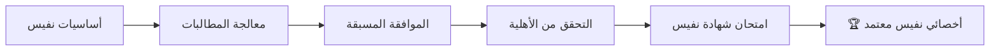

# أكاديمية برينسايت

**تمكين القوى العاملة الصحية السعودية لمستقبل رقمي أولاً**

> **رابط الأكاديمية:** [academy.brainsait.org](https://academy.brainsait.org)

---

## نظرة عامة

أكاديمية برينسايت هي منصة تعليمية متخصصة في تقنية المعلومات الصحية، مبنية لاحتياجات القطاع الصحي المتسارع رقمياً في المملكة العربية السعودية. من المرمِّزين والمتخصصين في الفوترة في الخط الأمامي إلى المديرين التنفيذيين الذين يقودون التحول الرقمي، تُوفِّر الأكاديمية مسارات تعلم منظمة وشهادات معتمدة ومختبرات عملية.

---

## كتالوج التعلم

### التدريب على تقنية المعلومات الصحية

| الدورة | المدة | المستوى | الشكل |
|--------|------|---------|------|
| مقدمة في المعلوماتية الصحية | 8 ساعات | مبتدئ | ذاتي |
| أساسيات السجلات الطبية الإلكترونية | 16 ساعة | مبتدئ | ذاتي + مباشر |
| إدارة بيانات الرعاية الصحية | 24 ساعة | متوسط | ذاتي |
| قابلية التشغيل البيني وأساسيات FHIR | 12 ساعة | متوسط | ذاتي |
| تبادل المعلومات الصحية | 20 ساعة | متوسط | مباشر + مختبرات |

### الذكاء الاصطناعي في دورات الرعاية الصحية

- **الذكاء الاصطناعي لدعم القرار السريري** — فهم توصيات الذكاء الاصطناعي في سير العمل السريري
- **شهادة وكلاء برينسايت** — تدريب عملي مع كليم لينك وبوليسي لينك ودوكس لينك وغيرها
- **تعلم الآلة لتحليلات RCM** — بناء نماذج تنبؤية لتحسين دورة الإيرادات
- **معالجة اللغة الطبيعية في الطب** — NLP للملاحظات السريرية والترميز الطبي
- **الذكاء الاصطناعي الأخلاقي في الرعاية الصحية** — التحيز والعدالة والنشر المسؤول للذكاء الاصطناعي

### شهادة نفيس والفوترة

أشمل برنامج تدريب نفيس في المملكة العربية السعودية:

**وحدات البرنامج:**

1. **هيكل نفيس** — نظرة عامة على المنصة وأنواع المعاملات والحوكمة
2. **FHIR R4 للفوترة** — هياكل الموارد ذات الصلة بالمطالبات السعودية
3. **دورة حياة المطالبة** — العملية الشاملة من التسجيل إلى الدفع
4. **سير عمل الموافقة المسبقة** — إرسال PA وتتبعه والاستئناف
5. **إدارة الرفض** — تحليل الأسباب الجذرية واستراتيجية الاستئناف
6. **الامتثال والتدقيق** — عمليات تدقيق وزارة الصحة ومتطلبات التوثيق

### إرشادات الترميز الطبي

- **ICD-10-CM للممارسة السعودية** — اتفاقيات الترميز مع سيناريوهات سريرية خاصة بالمملكة
- **ترميز CPT وHCPCS** — ترميز الإجراءات متوافق مع متطلبات الدافع في المملكة
- **تحسين DRG** — ترميز مجموعة التشخيص المرتبط للمنشآت المرضية الداخلية
- **تعديل مخاطر HCC** — ترميز الفئة الهرمية للحالات الصحية للرعاية القائمة على القيمة
- **المصطلحات الطبية العربية** — ربط المصطلحات الطبية العربية بأنظمة الترميز المعيارية

### قيادة الصحة الرقمية

| البرنامج | الجمهور | المدة |
|---------|---------|------|
| استراتيجية الصحة الرقمية | C-Suite / مجلس الإدارة | مكثف يومان |
| حوكمة الذكاء الاصطناعي في الرعاية الصحية | مديرو الطب / مديرو المعلومات | ورشة يوم واحد |
| ابتكار صحة رؤية 2030 | مسؤولون حكوميون | إحاطة نصف يوم |
| تحول الرعاية القائمة على القيمة | مديرو المستشفيات | برنامج 3 أيام |
| إدارة التغيير للصحة الرقمية | رؤساء الأقسام | ورشة يوم واحد |

---

## مسارات الشهادات

### أخصائي RCM المعتمد من برينسايت (CBRS)

**متطلبات الشهادة:**
- إتمام جميع الوحدات الأربع الأساسية (40 ساعة كحد أدنى)
- اجتياز الامتحان العملي بنسبة 80%+
- إتمام تمرين إرسال مطالبة حية مُشرف عليه
- إعادة الشهادة السنوية مع 8 ساعات CPD

### ممارس الذكاء الاصطناعي المعتمد في الرعاية الصحية (CHAP)

يُثبِت الكفاءة في نشر وإدارة وكلاء الذكاء الاصطناعي في البيئات الصحية:

- تقييم أساسيات الذكاء الاصطناعي والتطبيق الصحي
- تكوين ومراقبة وكيل برينسايت
- الامتحان العملي للأخلاقيات والحوكمة
- عرض دراسة حالة تكامل الذكاء الاصطناعي الواقعي

---

## ميزات التعلم

### محرك التعلم التكيفي

تستخدم الأكاديمية الذكاء الاصطناعي لتخصيص رحلة كل متعلم:

- **تقييم المهارات** — تشخيص ما قبل الالتحاق لتحديد الثغرات المعرفية
- **مسارات التعلم المخصصة** — تسلسلات وحدات مُعَدَّة حسب الدور والأهداف
- **التكرار المتباعد** — جلسات مراجعة مجدولة بالذكاء الاصطناعي للاحتفاظ طويل الأمد
- **تحليلات الأداء** — لوحات معلومات المديرين لمتابعة تعلم الفريق

### المختبرات العملية

- **بيئة نفيس التجريبية** — ممارسة المطالبات دون التأثير على الأنظمة الحقيقية
- **ملعب وكيل برينسايت** — تكوين واختبار وكلاء الذكاء الاصطناعي في بيئة آمنة
- **باني موارد FHIR** — أداة مرئية لتعلم إنشاء موارد FHIR R4
- **لعبة محاكاة الرفض** — تدريب سيناريوهات إدارة الرفض بأسلوب التلعيب

### تقديم المحتوى بلغتين

جميع محتوى الأكاديمية متاح باللغتين العربية والإنجليزية بالكامل:

- محاضرات مسجلة مع ترجمة مصاحبة بلغتين
- مواد مكتوبة عربية وإنجليزية مع توافق المصطلحات الطبية
- واجهة مستخدم عربية أولاً مع دعم كامل لـ RTL
- مدربون ثنائيو اللغة لجلسات الدورة المباشرة

---

## التطوير المهني المستمر

الأكاديمية معترف بها للاعتماد في التطوير المهني المستمر (CPD) من قِبَل الهيئات المهنية الصحية السعودية الرائدة. يكسب المتعلمون شارات رقمية قابلة للتحقق وشهادات CPD لكل برنامج مكتمل.

---

## الموارد ذات الصلة

- [منصة برينسايت](brainsait_platform.md)
- [بوابة HnH الصحية](hnh_portal.md)
- [نظرة عامة على نفيس](../nphies/overview.md)
- [وكلاء برينسايت](../agents/index.md)
