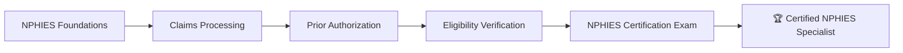
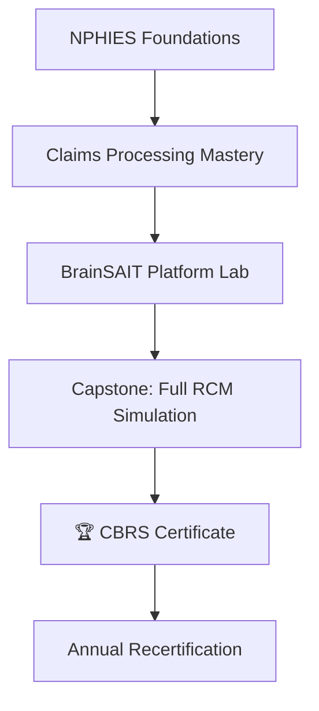

# BrainSAIT Academy

**Empowering the Saudi healthcare workforce for a digital-first future**

> **Academy URL:** [academy.brainsait.org](https://academy.brainsait.org)

---

## Overview

BrainSAIT Academy is a specialized healthcare IT education platform built for the needs of Saudi Arabia's rapidly digitalizing health sector. From frontline coders and billing specialists to C-suite executives driving digital transformation, the Academy provides structured learning paths, accredited certifications, and practical hands-on labs.

The Academy bridges the knowledge gap between traditional clinical training and the AI-powered tools now deployed across Saudi healthcare — ensuring every member of the health workforce can harness technology with confidence.

---

## Learning Catalog

### Healthcare IT Training

Foundational programs for clinical and administrative staff entering the digital health field:

| Course | Duration | Level | Format |
|--------|---------|-------|--------|
| Introduction to Health Informatics | 8 hours | Beginner | Self-paced |
| EMR Fundamentals | 16 hours | Beginner | Self-paced + Live |
| Healthcare Data Management | 24 hours | Intermediate | Self-paced |
| Interoperability & FHIR Basics | 12 hours | Intermediate | Self-paced |
| Health Information Exchange | 20 hours | Intermediate | Live + Labs |

### AI in Healthcare Courses

Practical programs for clinicians, administrators, and IT staff on deploying AI responsibly:

- **AI for Clinical Decision Support** — Understanding AI recommendations in clinical workflows
- **BrainSAIT Agents Certification** — Hands-on training with ClaimLinc, PolicyLinc, DocsLinc, and more
- **Machine Learning for Healthcare Analytics** — Building predictive models for RCM optimization
- **Natural Language Processing in Medicine** — NLP for clinical notes and medical coding
- **Ethical AI in Healthcare** — Bias, fairness, and responsible AI deployment

### NPHIES & Billing Certification

Saudi Arabia's most comprehensive NPHIES training program:

**Program Modules:**

1. **NPHIES Architecture** — Platform overview, transaction types, and governance
2. **FHIR R4 for Billing** — Resource structures relevant to Saudi claims
3. **Claim Lifecycle** — End-to-end process from registration to payment
4. **Prior Authorization Workflows** — PA submission, tracking, and appeals
5. **Denial Management** — Root cause analysis and appeals strategy
6. **Compliance & Audit** — MOH audits, documentation requirements, and penalties

### Medical Coding Guidelines

- **ICD-10-CM for Saudi Practice** — Coding conventions with Saudi-specific clinical scenarios
- **CPT & HCPCS Coding** — Procedure coding aligned with KSA payer requirements
- **DRG Optimization** — Diagnosis-Related Group coding for inpatient facilities
- **HCC Risk Adjustment** — Hierarchical Condition Category coding for value-based care
- **Arabic Medical Terminology** — Bridging clinical Arabic with standardized coding systems

### Digital Health Leadership

Executive programs for healthcare leaders:

| Program | Audience | Duration |
|---------|---------|---------|
| Digital Health Strategy | C-Suite / Board | 2-day intensive |
| AI Governance in Healthcare | CMOs / CIOs | 1-day workshop |
| Vision 2030 Health Innovation | Government officials | Half-day briefing |
| Value-Based Care Transformation | Hospital Directors | 3-day program |
| Change Management for Digital Health | Department Heads | 1-day workshop |

---

## Certification Pathways

### Certified BrainSAIT RCM Specialist (CBRS)

**Certification Requirements:**
- Complete all four core modules (40 hours minimum)
- Pass practical exam with 80%+ score
- Complete a supervised live claim submission exercise
- Annual recertification with 8 CPD hours

### Certified Healthcare AI Practitioner (CHAP)

Validates competency in deploying and managing AI agents in healthcare settings:

- AI fundamentals and healthcare application assessment
- BrainSAIT agent configuration and monitoring
- Ethics and governance practical examination
- Real-world AI integration case study presentation

---

## Learning Features

### Adaptive Learning Engine

The Academy uses AI to personalize each learner's journey:

- **Skill assessment** — Pre-enrollment diagnostic to identify knowledge gaps
- **Custom learning paths** — Curated module sequences based on role and goals
- **Spaced repetition** — AI-scheduled review sessions for long-term retention
- **Performance analytics** — Manager dashboards for team learning oversight

### Hands-On Labs

- **Sandbox NPHIES environment** — Practice claims without affecting real systems
- **BrainSAIT agent playground** — Configure and test AI agents in a safe environment
- **FHIR resource builder** — Visual tool for learning FHIR R4 resource creation
- **Denial simulation game** — Gamified denial management scenario training

### Bilingual Content Delivery

All Academy content is available in full Arabic and English:

- Recorded video lectures with bilingual subtitles
- Arabic and English written materials with medical terminology alignment
- Arabic-first user interface with full RTL support
- Bilingual instructors for live cohort sessions

---

## Corporate & Institutional Programs

### Team Subscriptions

| Plan | Users | Features |
|------|-------|---------|
| Team | 5–25 | Full catalog + progress tracking |
| Department | 26–100 | Custom learning paths + manager dashboard |
| Enterprise | 100+ | Branded portal + custom content + dedicated support |

### Custom Training Programs

BrainSAIT Academy develops bespoke training programs for:

- **Hospital networks** launching new digital health initiatives
- **Insurance companies** rolling out value-based contract programs
- **Government health agencies** upskilling workforce for Vision 2030 programs
- **Medical schools** integrating AI health informatics into curricula

---

## Continuing Professional Development

The Academy is recognized for CPD credit by leading Saudi healthcare professional bodies. Learners earn verifiable digital badges and CPD certificates for every completed program, shareable on LinkedIn and professional profiles.

---

## Related Resources

- [BrainSAIT Platform](brainsait_platform.md)
- [HnH Health Portal](hnh_portal.md)
- [NPHIES Overview](../nphies/overview.md)
- [BrainSAIT Agents](../agents/index.md)
