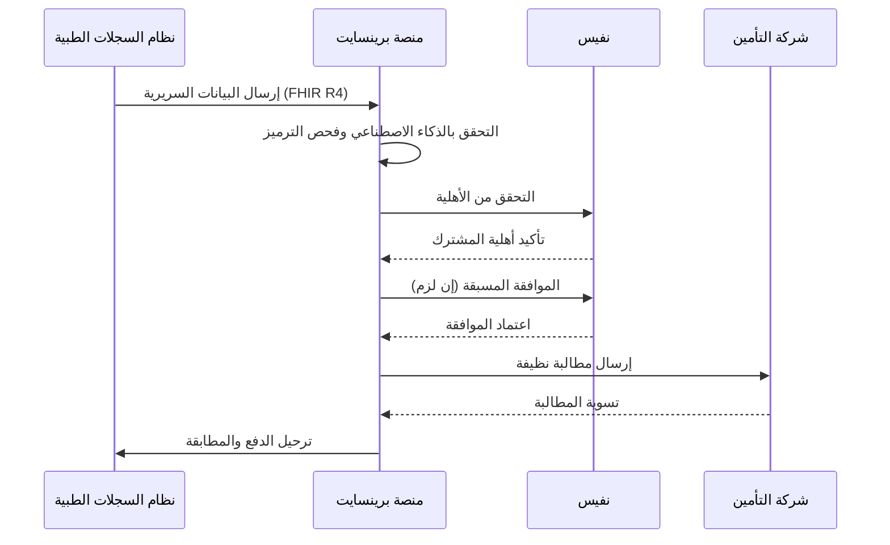

# منصة برينسايت

**إدارة الرعاية الصحية بالذكاء الاصطناعي للمملكة العربية السعودية**

> **رابط المنصة:** [brainsait.org](https://brainsait.org)

---

## نظرة عامة

برينسايت هي منصة ذكاء اصطناعي متخصصة في الرعاية الصحية، صُمِّمت خصيصاً لأتمتة وتحسين وتحويل العمليات السريرية ودورة الإيرادات عبر المنشآت الصحية السعودية. من العيادات الصغيرة إلى شبكات المستشفيات الكبرى، تتوسع المنصة لتلبية أي متطلبات تشغيلية مع الحفاظ على الامتثال الكامل للمعايير التنظيمية في المملكة.

---

## القدرات الأساسية

### إدارة دورة الإيرادات بالذكاء الاصطناعي

يُراقب محرك الذكاء الاصطناعي في برينسايت باستمرار جودة المطالبات وامتثال سياسات الدفع وحالة إرسالها عبر نفيس لتعظيم معدلات القبول في المرة الأولى.

### الامتثال لنفيس وقابلية التشغيل البيني FHIR R4

- **تكامل نفيس الأصيل** — موصلات جاهزة لجميع أنواع معاملات نفيس
- **مكتبة موارد FHIR R4** — أكثر من 200 ملف مورد معتمد وفق وزارة الصحة السعودية
- **فحص الأهلية الفوري** — التحقق اللحظي من أهلية الدافع قبل تقديم الخدمة
- **أتمتة الموافقة المسبقة** — إرسال الموافقة المسبقة تلقائياً مع المبرر السريري
- **معالجة مستردات المطالبات** — تحليل ERA تلقائي وترحيل المدفوعات

### دعم القرار السريري

| الميزة | الوصف |
|--------|--------|
| التحقق من التشخيص | فحص دقة رموز ICD-10-CM مقارنةً بالوثائق السريرية |
| مطابقة الإجراءات | توافق CPT/HCPCS مع الملاحظات السريرية عبر معالجة اللغة الطبيعية |
| تنبيهات التفاعل الدوائي | فحص أمان الأدوية في الوقت الفعلي |
| إرشادات المسار السريري | مقترحات علاجية قائمة على الأدلة |
| تحسين الترميز | تحسين الفئة الهرمية للحالات الصحية (HCC) |

---

## وكلاء برينسايت الذكيون

تأتي المنصة مزودة بستة وكلاء ذكاء اصطناعي متخصصين، كل منهم محسَّن لسير عمل رعاية صحية محدد:

| الوكيل | المجال | الوظيفة الرئيسية |
|--------|--------|-----------------|
| **كليم لينك** | دورة الإيرادات | التحقق الذكي من المطالبات وتحليل الرفض وإعادة التقديم |
| **بوليسي لينك** | سياسة الدافع | تفسير سياسة الدافع في الوقت الفعلي والتحقق من التغطية |
| **دوكس لينك** | التوثيق | استخراج الوثائق الطبية وتلخيصها ودعم الترميز |
| **راديو لينك** | الأشعة | تحليل تقارير التصوير التشخيصي واستخراج البيانات المنظمة |
| **فويس تو كير** | تفاعل المريض | تفاعل المريض الصوتي متعدد اللغات (عربي/إنجليزي) والتصنيف |
| **ماستر لينك** | التنسيق | تنسيق الوكلاء وأتمتة سير العمل |

---

## دعم اللغتين العربية والإنجليزية

كل مكون في منصة برينسايت يُقدِّم تجربة ثنائية اللغة بالكامل:

- **واجهة المستخدم والتنقل** — واجهة عربية وإنجليزية كاملة مع دعم تخطيط RTL
- **النماذج السريرية** — إدخال بيانات ثنائي اللغة بالمصطلحات الطبية العربية
- **التقارير والوثائق** — توليد تلقائي باللغتين
- **استجابات الوكيل الذكي** — نماذج NLP مدرَّبة على المجموعات الطبية العربية والإنجليزية
- **الإشعارات** — تنبيهات SMS وبريد إلكتروني بلغة المستخدم المفضلة

---

## الامتثال والأمان

### توافق HIPAA
- تشفير البيانات أثناء التخزين (AES-256) وأثناء النقل (TLS 1.3)
- التحكم في الوصول القائم على الأدوار (RBAC) مع تطبيق أقل الصلاحيات
- تسجيل تدقيق شامل لجميع أحداث الوصول إلى PHI
- نماذج اتفاقيات شريك العمل (BAA) متاحة

### الامتثال لنظام PDPL (حماية البيانات السعودية)
- إدارة موافقة المريض بأذونات تفصيلية
- إقامة البيانات في البنية التحتية المستضافة في المملكة العربية السعودية
- سير عمل الإشعار بالاختراق وفق جداول PDPL
- تقليل البيانات حسب التصميم

### ضوابط ISO 27001
- توافق نظام إدارة أمن المعلومات (ISMS)
- اختبارات الاختراق وتقييمات الثغرات
- خطة الاستجابة للحوادث مع اتفاقيات مستوى خدمة محددة

---

## خيارات النشر

| الوضع | الوصف | الأنسب لـ |
|-------|--------|---------|
| **SaaS سحابي** | مستضاف على بنية تحتية في المملكة (Cloudflare + Coolify) | العيادات والمستشفيات الصغيرة والمتوسطة |
| **سحابة خاصة** | مستأجر مخصص على VPC العميل | شبكات المستشفيات الكبرى |
| **هجين** | الجوهر في السحابة، البيانات الحساسة في الموقع | الجهات الصحية الحكومية |
| **حافة / مجموعة راسبيري** | نشر حافة منخفض الكمون للغاية | المرافق الصحية الريفية |

---

## الموارد ذات الصلة

- [بوابة HnH للمرضى](hnh_portal.md)
- [أكاديمية برينسايت](academy.md)
- [دليل تكامل نفيس](../nphies/overview.md)
- [وكيل كليم لينك](../agents/ClaimLinc.md)
