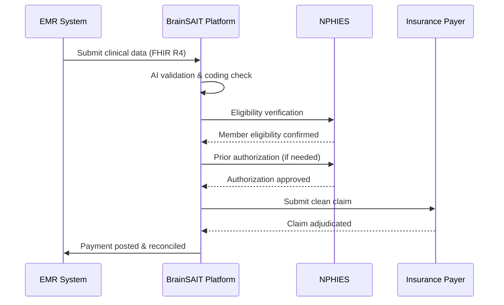
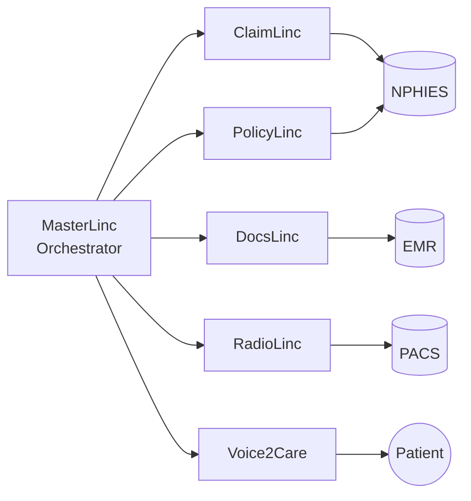

# BrainSAIT Platform

**AI-powered healthcare management for the Kingdom of Saudi Arabia**

> **Platform URL:** [brainsait.org](https://brainsait.org)

---

## Overview

BrainSAIT is a purpose-built healthcare AI platform designed to automate, optimize, and transform clinical and revenue cycle operations across Saudi healthcare facilities. From small clinics to large hospital networks, the platform scales to meet any operational demand while maintaining full compliance with KSA regulatory standards.

---

## Core Capabilities

### AI-Powered Revenue Cycle Management

BrainSAIT's AI engine continuously monitors claim quality, payer policy compliance, and NPHIES submission status to maximize first-pass acceptance rates.

### NPHIES Compliance & FHIR R4 Interoperability

- **Native NPHIES integration** — Pre-built connectors for all NPHIES transaction types
- **FHIR R4 resource library** — 200+ validated resource profiles aligned with Saudi MOH
- **Real-time eligibility checks** — Instant payer eligibility verification before service delivery
- **Prior authorization automation** — Automated PA submission with clinical justification
- **Claims remittance processing** — Automated ERA parsing and payment posting

### Clinical Decision Support

| Feature | Description |
|---------|-------------|
| Diagnosis validation | ICD-10-CM code accuracy checking against clinical documentation |
| Procedure matching | CPT/HCPCS alignment with clinical notes via NLP |
| Drug interaction alerts | Real-time medication safety screening |
| Clinical pathway guidance | Evidence-based treatment suggestions |
| Coding optimization | Hierarchical Condition Category (HCC) optimization |

### Real-Time Analytics Dashboard

Track financial and operational KPIs from a single command center:

- **Claim Performance** — Daily submission volumes, acceptance rates, denial trends
- **Revenue Forecasting** — AI-predicted cash flow based on payer behavior patterns
- **Denial Root Cause Analysis** — Automated categorization of denial reasons
- **Staff Productivity** — Coder and biller performance benchmarking
- **Payer Scorecards** — Response time and payment rate by insurance company

---

## BrainSAIT AI Agents

The platform ships with six specialized AI agents, each optimized for a distinct healthcare workflow:

| Agent | Domain | Key Function |
|-------|--------|-------------|
| **ClaimLinc** | Revenue Cycle | Intelligent claim validation, rejection analysis, and resubmission |
| **PolicyLinc** | Payer Policy | Real-time payer policy interpretation and coverage verification |
| **DocsLinc** | Documentation | Medical document extraction, summarization, and coding support |
| **RadioLinc** | Radiology | Diagnostic image report parsing and structured data extraction |
| **Voice2Care** | Patient Engagement | Multilingual (AR/EN) voice-based patient interaction and triage |
| **MasterLinc** | Orchestration | Cross-agent coordination and workflow automation |

### Agent Integration Model

---

## Bilingual (AR/EN) Support

Every component of the BrainSAIT platform delivers a fully bilingual experience:

- **UI & Navigation** — Full Arabic and English interface with RTL layout support
- **Clinical Forms** — Bilingual data entry with Arabic medical terminology
- **Reports & Documents** — Auto-generated in both languages
- **AI Agent Responses** — NLP models trained on Arabic and English medical corpora
- **Notifications** — SMS and email alerts in the user's preferred language

---

## Compliance & Security

### HIPAA Alignment
- Encrypted data at rest (AES-256) and in transit (TLS 1.3)
- Role-based access control (RBAC) with least-privilege enforcement
- Comprehensive audit logging for all PHI access events
- Business Associate Agreement (BAA) templates available

### PDPL Compliance (Saudi Data Protection)
- Patient consent management with granular permissions
- Data residency in KSA-based infrastructure
- Breach notification workflows meeting PDPL timelines
- Data minimization by design

### ISO 27001 Controls
- Information security management system (ISMS) alignment
- Penetration testing and vulnerability assessments
- Incident response plan with defined SLAs

---

## Deployment Options

| Mode | Description | Best For |
|------|------------|---------|
| **SaaS Cloud** | Hosted on KSA infrastructure (Cloudflare + Coolify) | Clinics & SME hospitals |
| **Private Cloud** | Dedicated tenant on customer VPC | Large hospital networks |
| **Hybrid** | Core in cloud, sensitive data on-premise | Government health entities |
| **Edge/Raspberry Cluster** | Ultra-low latency edge deployment | Rural health facilities |

---

## Getting Started

1. **Onboarding** — Platform setup, EMR connector configuration, and staff training
2. **Integration** — FHIR R4 API connection to existing EMR within 2 weeks
3. **Agent Activation** — Enable AI agents by workflow priority
4. **Go-Live** — Production deployment with BrainSAIT support team oversight
5. **Optimization** — Continuous performance tuning based on analytics insights

---

## Related Resources

- [HnH Patient Portal](hnh_portal.md)
- [BrainSAIT Academy](academy.md)
- [NPHIES Integration Guide](../nphies/overview.md)
- [ClaimLinc Agent](../agents/ClaimLinc.md)
