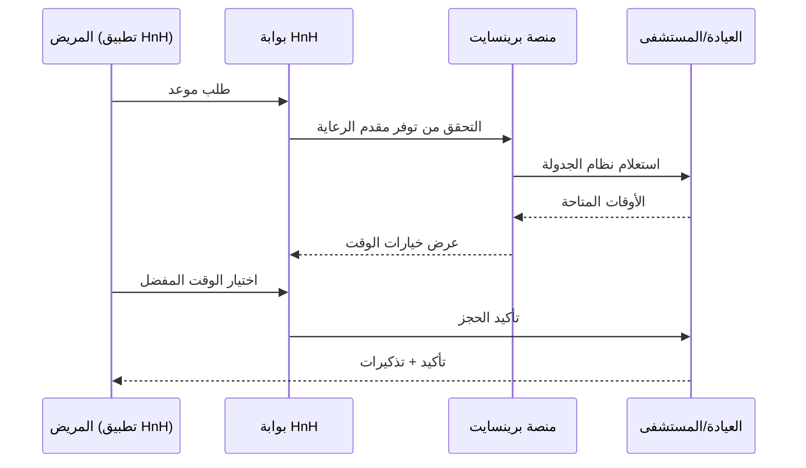

# بوابة HnH الصحية

**الصحة والانسجام — رفيقك الصحي الشخصي**

> **رابط البوابة:** [hnh.brainsait.org](https://hnh.brainsait.org)

---

## نظرة عامة

بوابة "الصحة والانسجام" (HnH) هي منصة الصحة الرقمية الموجهة للمرضى في برينسايت، تُتيح للمقيمين في المملكة العربية السعودية الوصول السلس إلى معلوماتهم الصحية وفرق رعايتهم وبرامج العافية. تجسر HnH الفجوة بين الأنظمة السريرية وتجربة المريض اليومية، مُمكِّنةً الأفراد من الدور الفاعل في إدارة صحتهم.

مبنية على معايير FHIR R4 ومتكاملة مع طبقة الذكاء الاصطناعي في برينسايت، تُقدِّم HnH خدمات رعاية صحية مخصصة وثنائية اللغة (عربي/إنجليزي) ومتاحة عبر الويب والجوال.

---

## الميزات الأساسية

### السجلات الصحية للمريض

يتمتع المرضى بوصول آمن وفوري إلى سجلهم الصحي الشامل:

- **نتائج المختبر** — نتائج فورية مع نطاقات مرجعية وتصور الاتجاهات
- **تقارير التصوير** — تقارير التشخيص مع ملخصات بلغة بسيطة بالذكاء الاصطناعي
- **الأدوية** — الوصفات الفعّالة وجدول الجرعات وتذكيرات التجديد
- **الحساسيات والحالات** — قائمة مشاكل منظمة مع سياق تاريخي
- **سجل التطعيمات** — سجلات التحصين وفق وزارة الصحة مع تذكيرات قادمة
- **ملخصات الزيارات** — ملاحظات ما بعد الزيارة من كل تفاعل رعاية

### إدارة المواعيد

- **توافر الفتحات الزمنية الفوري** عبر مقدمي الرعاية الصحية المتصلين
- **استشارات مرئية داخل التطبيق** مع تشفير من طرف إلى طرف
- **تذكيرات تلقائية** عبر SMS وواتساب والبريد الإلكتروني (عربي/إنجليزي)
- **إدارة قائمة الانتظار** لاحتياجات الرعاية العاجلة
- **إعادة الجدولة الذكية** مع أوقات بديلة مقترحة بالذكاء الاصطناعي

### الطب عن بُعد

| الميزة | التفاصيل |
|--------|---------|
| جودة الفيديو | HD 1080p مع معدل البت التكيفي |
| مشاركة الشاشة | يمكن للأطباء مشاركة نتائج المختبر أثناء المكالمة |
| التسجيل | تسجيل اختياري للجلسة بموافقة المريض |
| الترجمة | نسخ فوري بالذكاء الاصطناعي باللغتين العربية والإنجليزية |
| الأجهزة | الويب وiOS وAndroid |

### برامج العافية والوقاية

تُقدِّم HnH رحلات عافية مخصصة تتماشى مع الأولويات الصحية الوطنية السعودية:

- **إدارة الأمراض المزمنة** — برامج منظمة لمرضى السكري وارتفاع ضغط الدم والسمنة
- **دعم الصحة النفسية** — تدخلات رقمية إرشادية قائمة على اليقظة الذهنية والعلاج المعرفي
- **صحة الأمومة** — تتبع الحمل مع دلائل أسبوعية
- **عافية الأطفال** — تتبع النمو وجدولة التطعيمات للأطفال
- **عافية الشركات** — برامج صحية برعاية أصحاب العمل وتتبع القياسات الحيوية

---

## الميزات المدعومة بالذكاء الاصطناعي

### تكامل فويس تو كير

بوابة HnH مدعومة بوكيل **فويس تو كير** من برينسايت للتوجيه الذكي للمرضى:

- فحص الأعراض الصوتي باللغتين العربية والإنجليزية
- تصنيف تلقائي لمستوى الرعاية المناسب (طارئ، روتيني، رعاية ذاتية)
- طلبات تجديد الوصفات عبر الصوت
- حجز المواعيد من خلال الذكاء الاصطناعي التحادثي
- مكالمات متابعة ما بعد الزيارة وفحوصات الالتزام بالأدوية

---

## الخصوصية والأمان

بيانات المريض في HnH محمية بضوابط أمان على مستوى المؤسسات:

- **الامتثال لنظام PDPL** — التوافق الكامل مع نظام حماية البيانات الشخصية السعودي
- **موافقة المريض** — موافقة تفصيلية قابلة للإلغاء لكل سيناريو مشاركة بيانات
- **تصميم عدم المعرفة** — وصول فريق الرعاية يتطلب تفويضاً صريحاً من المريض
- **التشفير الشامل** — جميع بيانات الصحة مشفرة أثناء النقل والتخزين
- **المصادقة البيومترية** — تسجيل دخول بالوجه والبصمة على التطبيقات المحمولة
- **توطين البيانات** — جميع بيانات المريض مخزنة داخل المملكة العربية السعودية

---

## الموارد ذات الصلة

- [منصة برينسايت](brainsait_platform.md)
- [وكيل فويس تو كير](../agents/Voice2Care.md)
- [أكاديمية برينسايت](academy.md)
- [توافق HIPAA وPDPL](../nphies/hipaa_pdpl_alignment.md)
