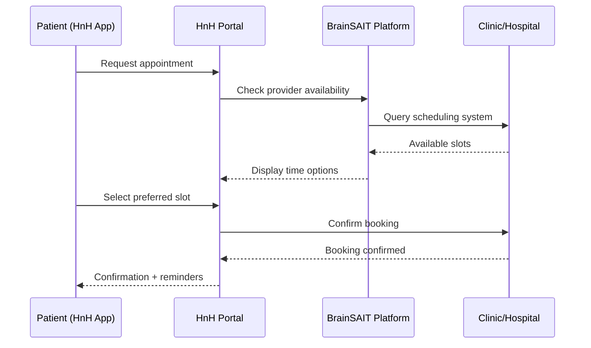
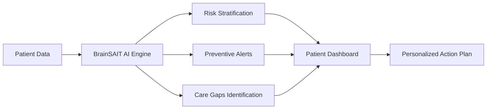

# HnH Health Portal

**Health and Harmony — Your personal healthcare companion**

> **Portal URL:** [hnh.brainsait.org](https://hnh.brainsait.org)

---

## Overview

The Health and Harmony (HnH) portal is BrainSAIT's patient-facing digital health platform, providing Saudi residents with seamless access to their health information, care teams, and wellness programs. HnH bridges the gap between clinical systems and everyday patient experience, empowering individuals to take an active role in managing their health.

Built on FHIR R4 standards and integrated with the BrainSAIT AI layer, HnH delivers personalized, bilingual (AR/EN), and accessible healthcare services across web and mobile.

---

## Core Features

### Patient Health Records

Patients have secure, on-demand access to their complete longitudinal health record:

- **Lab Results** — Real-time results with reference ranges and trend visualization
- **Imaging Reports** — Diagnostic reports with AI-generated plain-language summaries
- **Medications** — Active prescriptions, dosing schedule, and refill reminders
- **Allergies & Conditions** — Structured problem list with historical context
- **Vaccination History** — MOH-aligned immunization records with upcoming reminders
- **Visit Summaries** — After-visit notes from every care encounter

### Appointment Management

- **Real-time slot availability** across connected healthcare providers
- **In-app video consultations** with end-to-end encryption
- **Automated reminders** via SMS, WhatsApp, and email (AR/EN)
- **Waitlist management** for urgent care needs
- **Smart rescheduling** with AI-suggested alternative times

### Telemedicine

| Feature | Details |
|---------|---------|
| Video quality | HD 1080p with adaptive bitrate |
| Screen sharing | Physicians can share lab results during call |
| Recording | Optional session recording with patient consent |
| Interpretation | AI-assisted Arabic/English real-time transcription |
| Devices | Web, iOS, Android |

### Wellness & Prevention Programs

HnH delivers personalized wellness journeys aligned with Saudi national health priorities:

- **Chronic Disease Management** — Structured programs for diabetes, hypertension, and obesity
- **Mental Health Support** — Guided mindfulness and CBT-based digital interventions
- **Maternal Health** — Pregnancy tracking with weekly milestone guides
- **Pediatric Wellness** — Growth tracking and vaccination scheduling for children
- **Corporate Wellness** — Employer-sponsored health programs and biometric tracking

---

## AI-Powered Features

### Voice2Care Integration

The HnH portal is powered by BrainSAIT's **Voice2Care** agent for intelligent patient navigation:

- Arabic and English voice-based symptom checker
- Automated triage to appropriate care level (urgent, routine, self-care)
- Prescription refill requests via voice
- Appointment booking through conversational AI
- Post-visit follow-up calls and medication adherence checks

### Personalized Health Insights

---

## Bilingual Experience

Every touchpoint in HnH is fully bilingual:

| Element | Arabic (RTL) | English (LTR) |
|---------|-------------|--------------|
| Navigation | ✅ Complete Arabic UI | ✅ Full English UI |
| Health content | ✅ Medical Arabic | ✅ Plain English |
| Notifications | ✅ Arabic SMS/Email | ✅ English SMS/Email |
| Voice assistant | ✅ Modern Standard Arabic | ✅ English NLP |
| Documents | ✅ Arabic PDF export | ✅ English PDF export |

---

## Privacy & Security

Patient data in HnH is protected by enterprise-grade security controls:

- **PDPL Compliance** — Full compliance with Saudi Personal Data Protection Law
- **Patient Consent** — Granular, revocable consent for every data sharing scenario
- **Zero-knowledge design** — Care team access requires explicit patient authorization
- **End-to-end encryption** — All health data encrypted in transit and at rest
- **Biometric authentication** — Face ID and fingerprint login on mobile apps
- **Data localization** — All patient data stored within Kingdom of Saudi Arabia

---

## Integration with Healthcare Providers

HnH connects to the broader healthcare ecosystem via FHIR R4 APIs:

- **Hospital EMRs** — Bi-directional data sync with major KSA EMR vendors
- **Pharmacy networks** — E-prescription routing and medication pickup notifications
- **Laboratory systems** — Automated result delivery within minutes of release
- **Radiology PACS** — Image access with AI-enhanced report viewing
- **Insurance payers** — Real-time eligibility and benefit display for patients

---

## Mobile Application

Available on iOS and Android with offline capability for critical health data:

- Personal health record (PHR) accessible without internet
- Appointment calendar with local notifications
- Medication reminders with snooze and confirmation logging
- Emergency health information card (blood type, allergies, medications)
- QR code for emergency care providers to access critical health data

---

## Related Resources

- [BrainSAIT Platform](brainsait_platform.md)
- [Voice2Care Agent](../agents/Voice2Care.md)
- [BrainSAIT Academy](academy.md)
- [HIPAA & PDPL Alignment](../nphies/hipaa_pdpl_alignment.md)
