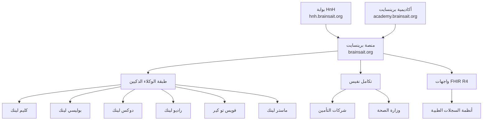

# منصة برينسايت للرعاية الصحية

**تحويل الرعاية الصحية السعودية من خلال الابتكار المدعوم بالذكاء الاصطناعي**

---

## نظرة عامة

منصة برينسايت للرعاية الصحية هي منظومة متكاملة من الحلول الذكية للرعاية الصحية، صُمِّمت لتسريع تحوّل المملكة العربية السعودية الرقمي في مجال الصحة ضمن إطار رؤية 2030. تقوم المنصة على معايير FHIR R4 مع الامتثال الكامل لمتطلبات نفيس، وتُقدِّم ذكاءً صحياً شاملاً على المستويين السريري والتشغيلي والتعليمي.

---

## مكونات المنصة

---

## المنصة الأساسية: brainsait.org

المنصة الرئيسية لبرينسايت تُقدِّم إدارة الرعاية الصحية بالذكاء الاصطناعي للمنشآت الصحية السعودية:

- **الوكلاء الذكيون** — ستة وكلاء متخصصون يؤتمتون دورة الإيرادات بالكامل
- **الامتثال لنفيس** — تكامل أصيل مع منصة التبادل الصحي الوطنية
- **قابلية التشغيل البيني FHIR R4** — تبادل البيانات وفق المعايير مع أي نظام سجلات طبية
- **التحليلات الفورية** — أداء المطالبات واتجاهات الرفض والرؤى المالية
- **الامتثال HIPAA وPDPL** — أمان وخصوصية البيانات على مستوى المؤسسات

**[استكشف منصة برينسايت ←](brainsait_platform.md)**

---

## بوابة HnH الصحية: hnh.brainsait.org

بوابة "الصحة والانسجام" هي بوابة المريض التي تجسر الفجوة بين مقدمي الرعاية الصحية والمرضى:

- **مركز صحة المريض** — سجلات صحية شخصية ونتائج مخبرية وخطط رعاية
- **إدارة المواعيد** — جدولة سلسة مع تكامل الطب عن بُعد
- **برامج الصحة الوقائية** — رحلات عافية مصممة حسب الاحتياجات الفردية
- **التصنيف الطبي بالذكاء الاصطناعي** — تكامل فويس تو كير للتوجيه الذكي للمرضى

**[استكشف بوابة HnH ←](hnh_portal.md)**

---

## أكاديمية برينسايت: academy.brainsait.org

منصة تعليمية متخصصة تُجهِّز القوى العاملة الصحية السعودية بالمهارات الرقمية:

- **شهادة نفيس** — تدريب معتمد لفرق الفوترة والمطالبات
- **الذكاء الاصطناعي في الرعاية الصحية** — دورات عملية في نشر الوكلاء الذكيين
- **الترميز الطبي** — إرشادات ICD-10 وCPT وخاصة المملكة العربية السعودية
- **برامج القيادة** — تحول الصحة الرقمية للمديرين التنفيذيين

**[استكشف أكاديمية برينسايت ←](academy.md)**

---

## هيكل التكامل

| الطبقة | التقنية | المعيار |
|--------|---------|---------|
| بوابة API | REST / GraphQL | FHIR R4 |
| الهوية والوصول | OAuth 2.0 / SAML | SMART on FHIR |
| تبادل البيانات | HL7 FHIR R4 | ملف وزارة الصحة السعودية |
| الامتثال | تسجيل التدقيق | PDPL / HIPAA |
| الأمان | TLS 1.3، تشفير شامل | ISO 27001 |

---

## المقاييس الرئيسية

| المقياس | النتيجة |
|---------|---------|
| معدل المطالبات النظيفة | **98%+** |
| تقليص الرفض | **>60%** |
| الوقت الموفَّر في المعالجة | **80%** |
| الأيام في حسابات القبض | **<30 يوماً** |
| معدل القبول الأول في نفيس | **95%+** |

---

## الموارد ذات الصلة

- [وكلاء برينسايت](../agents/index.md)
- [معايير نفيس](../nphies/overview.md)
- [إطار الامتثال](../nphies/hipaa_pdpl_alignment.md)
