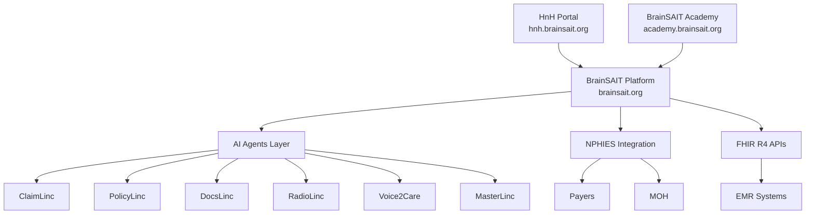

# BrainSAIT Healthcare Platform

**Transforming Saudi healthcare through AI-powered innovation**

---

## Overview

The BrainSAIT Healthcare Platform is an integrated ecosystem of AI-powered healthcare solutions designed to accelerate Saudi Arabia's Vision 2030 digital health transformation. Built on FHIR R4 standards with full NPHIES compliance, the platform delivers end-to-end healthcare intelligence across clinical, operational, and educational domains.

---

## Platform Components

---

## Core Platform: brainsait.org

The flagship BrainSAIT platform delivers AI-powered healthcare management for Saudi healthcare facilities:

- **AI Agents** — Six specialized agents automating the full revenue cycle
- **NPHIES Compliance** — Native integration with Saudi Arabia's national health exchange
- **FHIR R4 Interoperability** — Standards-based data exchange with any EMR
- **Real-time Analytics** — Claim performance, denial trends, and revenue insights
- **HIPAA & PDPL Compliance** — Enterprise-grade data security and privacy

**[Explore BrainSAIT Platform →](brainsait_platform.md)**

---

## HnH Health Portal: hnh.brainsait.org

Health and Harmony (HnH) is the patient-facing portal that bridges the gap between healthcare providers and the patients they serve:

- **Patient Wellness Hub** — Personal health records, lab results, and care plans
- **Appointment Management** — Seamless scheduling with integrated telemedicine
- **Preventive Health Programs** — Wellness journeys tailored to individual needs
- **AI-Assisted Triage** — Voice2Care integration for smart patient navigation

**[Explore HnH Portal →](hnh_portal.md)**

---

## BrainSAIT Academy: academy.brainsait.org

A dedicated healthcare education platform equipping the Saudi health workforce with AI-ready skills:

- **NPHIES Certification** — Accredited training for billing and claims teams
- **AI in Healthcare** — Practical courses on deploying AI agents
- **Medical Coding** — ICD-10, CPT, and Saudi-specific coding guidelines
- **Leadership Programs** — Digital health transformation for senior executives

**[Explore BrainSAIT Academy →](academy.md)**

---

## Integration Architecture

| Layer | Technology | Standard |
|-------|-----------|----------|
| API Gateway | REST / GraphQL | FHIR R4 |
| Identity | OAuth 2.0 / SAML | SMART on FHIR |
| Data Exchange | HL7 FHIR R4 | Saudi MOH Profile |
| Compliance | Audit logging | PDPL / HIPAA |
| Security | TLS 1.3, E2E encryption | ISO 27001 |

---

## Key Metrics

| Metric | Result |
|--------|--------|
| Clean claim rate | **98%+** |
| Denial reduction | **>60%** |
| Processing time saved | **80%** |
| Days in AR | **<30 days** |
| NPHIES first-pass rate | **95%+** |

---

## Related Resources

- [BrainSAIT Agents](../agents/index.md)
- [NPHIES Standards](../nphies/overview.md)
- [Compliance Framework](../nphies/hipaa_pdpl_alignment.md)
